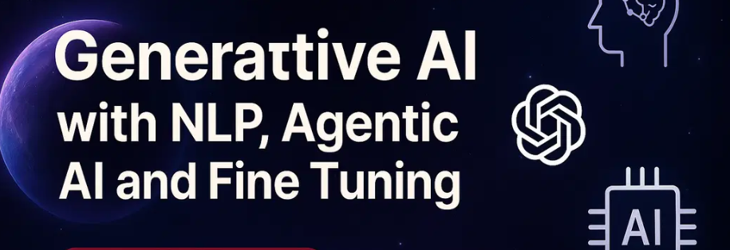

# Generative AI with NLP, Agentic AI and Fine Tuning

#### Generative AI with NLP, Agentic AI & Fine-Tuning: Build, Train, and Deploy Advanced AI Models

Master NLP & Word Embeddings: Understand text preprocessing, tokenization, stemming, lemmatization, POS tagging, and embedding techniques like Word2Vec, TF-IDF, and BERT.

Deep Dive into Transformers & Attention Mechanisms: Learn how Transformers, Self-Attention, Multi-Head Attention, and Positional Encoding work in Large Language Models (LLMs).

Hands-on with Hugging Face & OpenAI APIs: Implement AI models using Hugging Face Pipelines, fine-tune OpenAI models, and integrate function calling in OpenAI API.

Vector Databases for LLMs: Work with ChromaDB, Pinecone, Weaviate, and FAISS for efficient data retrieval and RAG-based applications.

End-to-End LangChain & LlamaIndex Applications: Develop retrieval-augmented generation (RAG) systems, automate workflows with AI agents, and work with custom document processing pipelines.

Fine-Tuning Large Language Models: Train and fine-tune Open-Source models like LLaMA, Falcon, and Mistral using LoRA & QLoRA for cost-efficient deployment.

Multimodal AI & Vision-Language Models: Implement AI systems that process text + image + video, leveraging GPT-4o Vision and LangChain.

Build & Deploy Real-World AI Applications: Create AI-powered assistants, knowledge retrieval systems, and custom generative AI models from scratch with hands-on projects.
